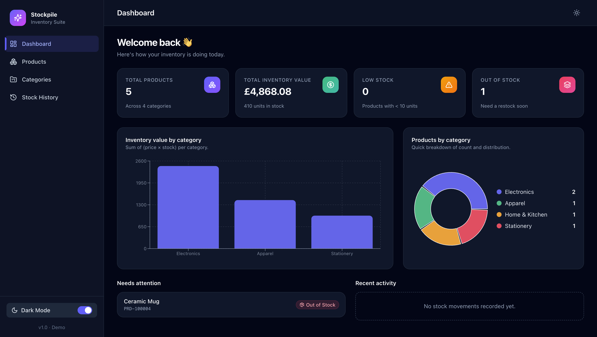
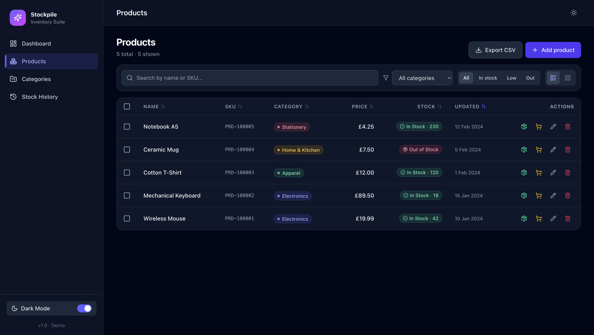
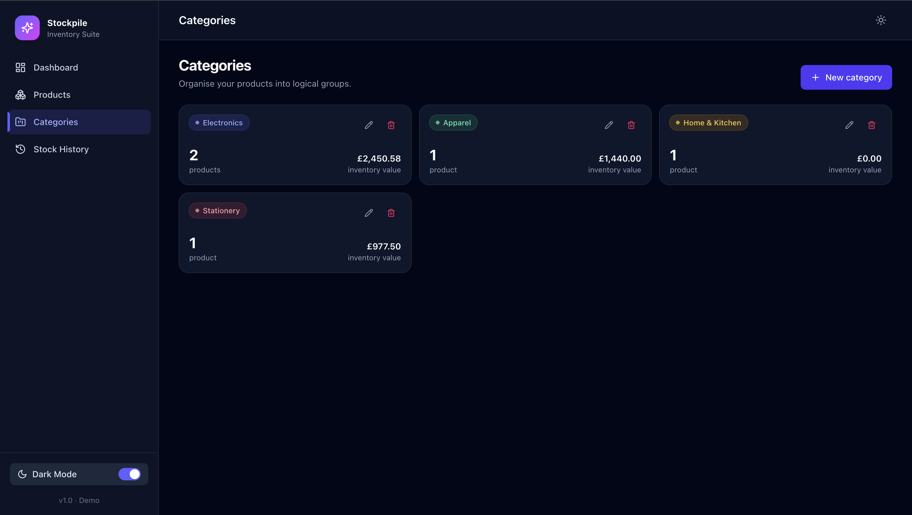
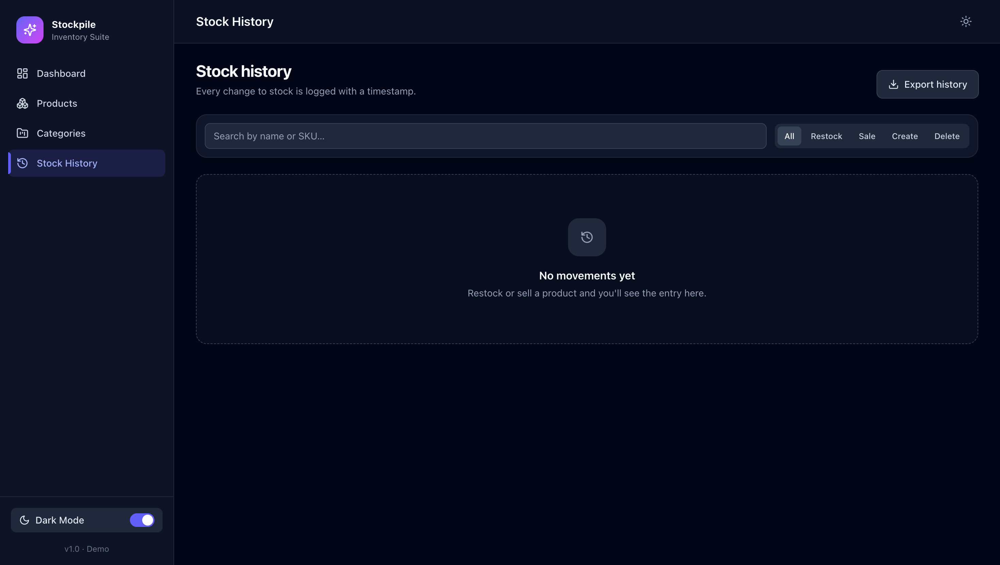

# Stockpile - Inventory Management System

## Project Overview

Stockpile is a frontend Inventory Management System built to help users manage products, categories and stock levels efficiently.

The application allows users to create and manage products, organise products by category, update stock quantities, monitor inventory statistics and view stock movement history.

This project was developed as part of a Software Development Intern technical task. The application is built as a frontend only system using React and local storage for data persistence.

## Features Implemented

### Product Management
- Add new products
- Edit existing products
- Delete products
- View product details
- Search products by name or SKU
- Filter products by category
- Filter products by stock status
- Increase stock quantity (restock)
- Decrease stock quantity (sales)

Each product contains:
- Product name
- Product ID / SKU
- Category
- Price
- Stock quantity

### Dashboard
- Total product count
- Total inventory value
- Low stock overview
- Out of stock overview
- Inventory value by category chart
- Product distribution by category chart

### Category Management
- Create custom categories
- Assign products to categories
- View category statistics
- Edit and delete categories

### Stock History
- Records stock changes with timestamps
- Tracks stock additions and removals
- Provides history filtering and searching

### Additional Features
- Dark mode support
- CSV export functionality
- Responsive layout for desktop and mobile devices
- Analytics charts

## Technologies Used

- React.js
- TypeScript
- Vite
- Tailwind CSS
- React Router
- LocalStorage

## Installation and Setup

### 1. Clone the repository

```bash
 git clone <repository-url>
```

### 2. Navigate into the project folder

```bash
cd inventory-management
```

### 3. Install dependencies

```bash
npm install
```

### 4. Start the development server

```bash
npm run dev
```

The application will run locally at:

```
http://localhost:5173/
```

## Project Structure

```
src
├── components      # Reusable UI components
├── pages           # Application pages
├── context         # Global state management
├── lib             # Utility functions
├── types           # TypeScript interfaces
├── App.tsx
└── main.tsx
```

## Screenshots

### Dashboard


### Products


### Categories


### Stock History


## Design Approach

The application follows a component based React architecture. Reusable components are used to improve maintainability and keep the code organised.

The UI focuses on simplicity, usability and responsive design to provide a clean inventory management experience.

## Future Improvements

Possible improvements include:

- Backend database integration
- User authentication
- Role-based access control
- Advanced reporting features

## Author

Developed by Senadhi
